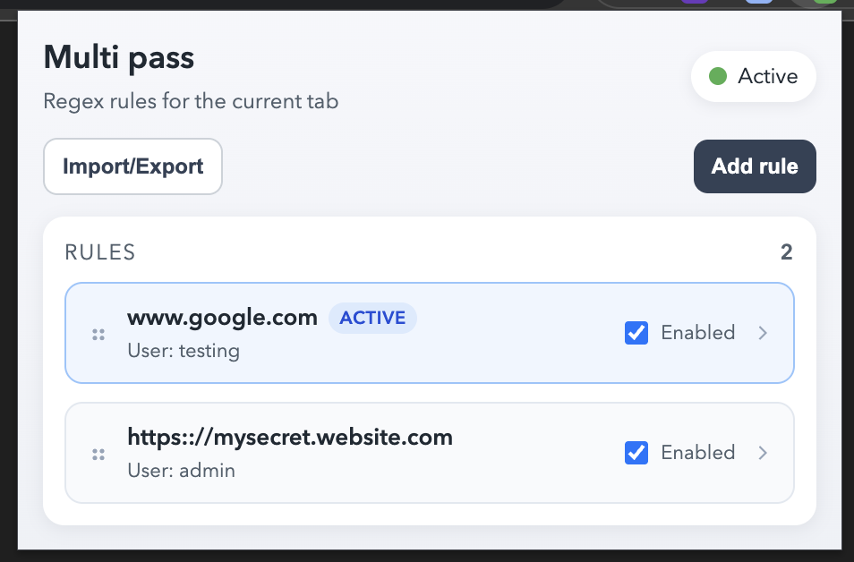
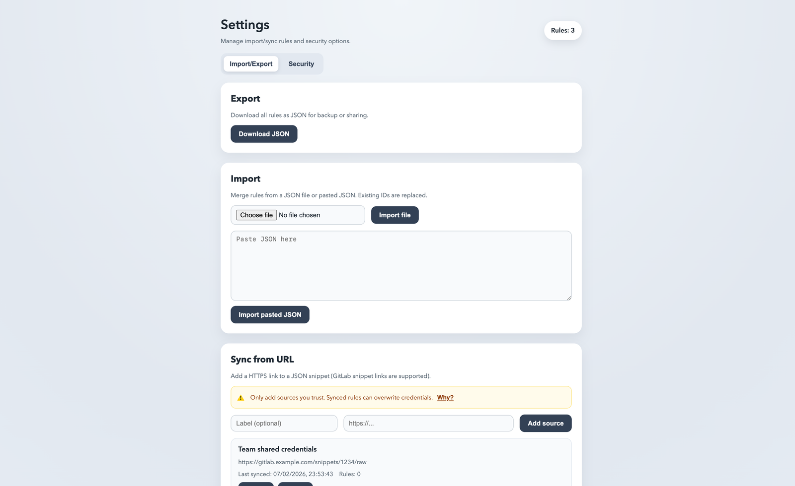

# Multi-pass V2

Multi-pass V2 is a browser extension that supplies HTTP Basic Auth credentials based on regex rules. It supports local rules, synced rules from shared JSON snippets, conflict detection, and per-tab status indicators.





## Features
- Regex-based Basic Auth rules with priority ordering.
- Per-tab status with conflict warnings.
- **Security vault lock (MV3):** optional master password, encrypted credentials at rest, lock/unlock from popup.
- Sync rules from HTTPS JSON snippets (GitLab snippet links supported).
- Import/export for local rules only.
- Chromium MV3 and Firefox MV3/MV2 builds.

## Usage
1. Load the extension in your browser.
2. (Optional, recommended) In popup, enable **Secure vault** with a master password.
3. Open a Basic Auth page and click **Add rule** to create a new entry.
4. Edit the rule details and **Save**.
5. Use the options page to import/export or add sync sources.

When vault lock is enabled, credentials are only usable after unlocking the extension in the popup.

## Build
Generate bundles for Chromium and Firefox:

```bash
node scripts/build.js
```

Artifacts are written to `dist/` and zipped per target.

## Versioning
Semantic commits are used to automatically bump the version on `main` and publish a GitHub release.
